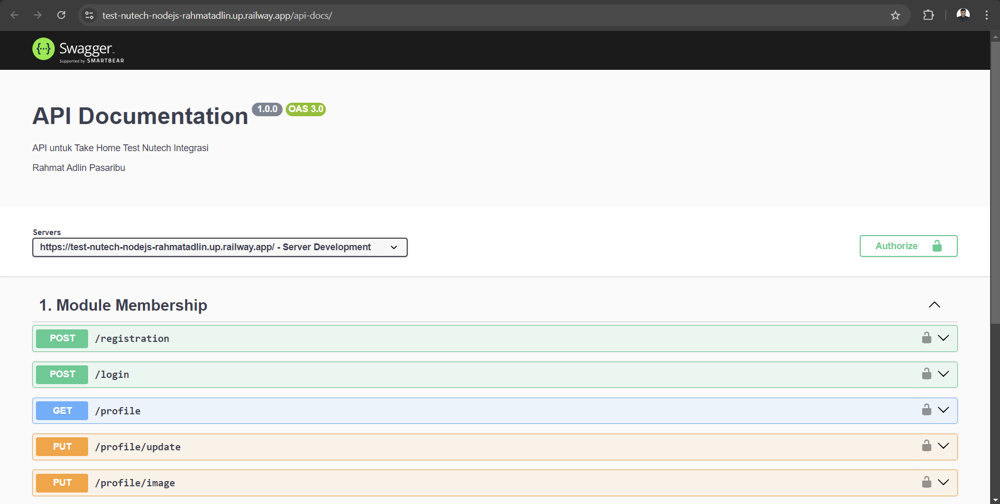

# Take Home Test nutech


## Overview
This project is a Node.js application hosted on Railway.  The application provides various features and functionalities to support your requirements.

## Database Deployment

The application uses Vercel Storage to manage and deploy the database.

## Live Demo

You can access the live demo of the application at the following link:

Here’s a screenshot of the application:

[Live Demo](https://test-nutech-nodejs-rahmatadlin.up.railway.app/)

 

## Installation

To run this project locally, follow these steps:

1. Clone the repository:
   ```bash
   git clone https://github.com/rahmatadlin/Test-Nutech-NodeJS.git
2. Install the dependencies:
    ```bash
    npm install
3. Start the application
    ```bash
    npm run start